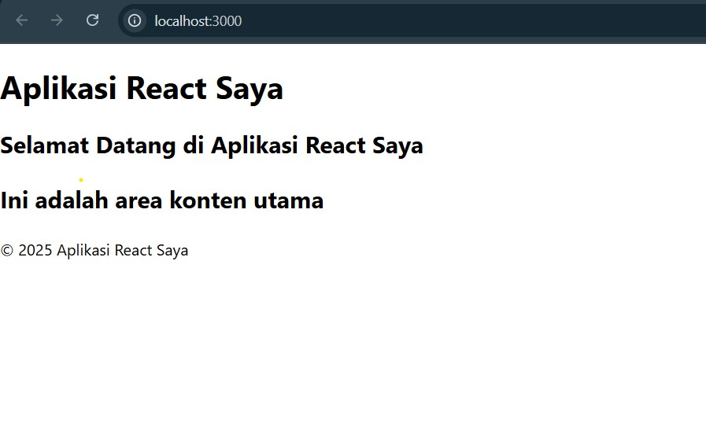
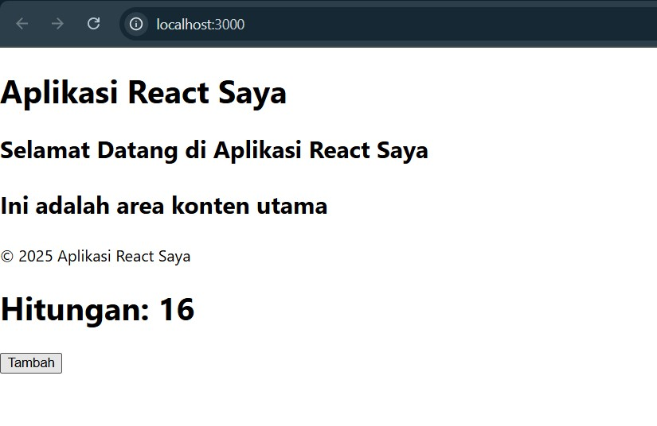
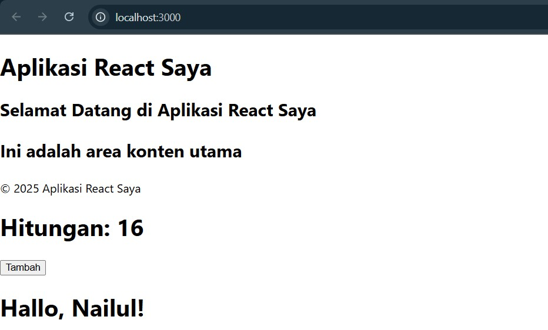
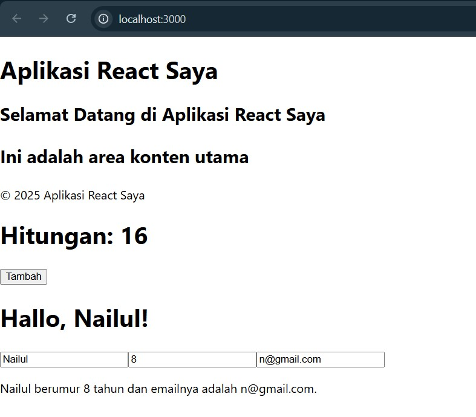
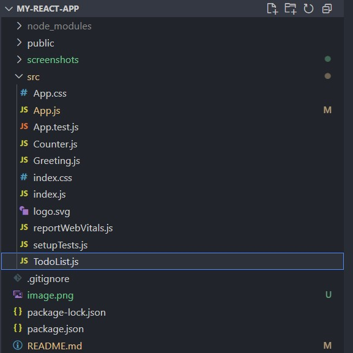
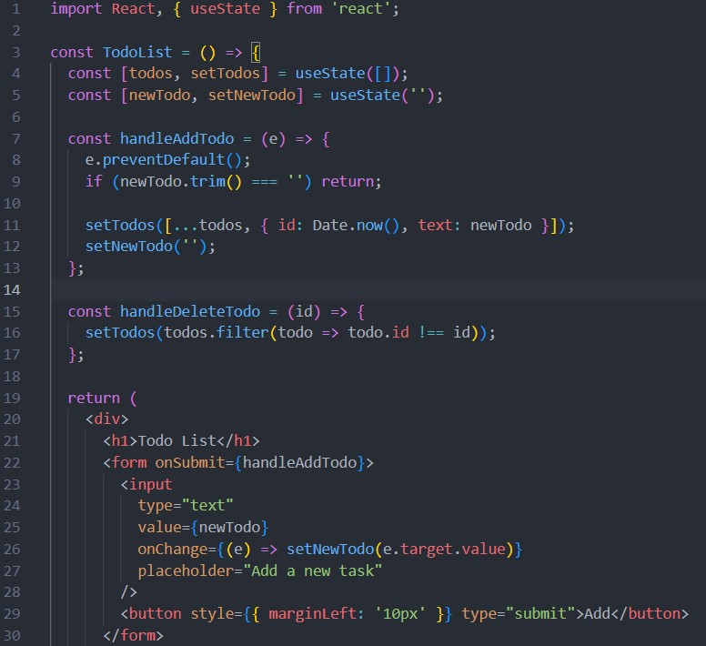
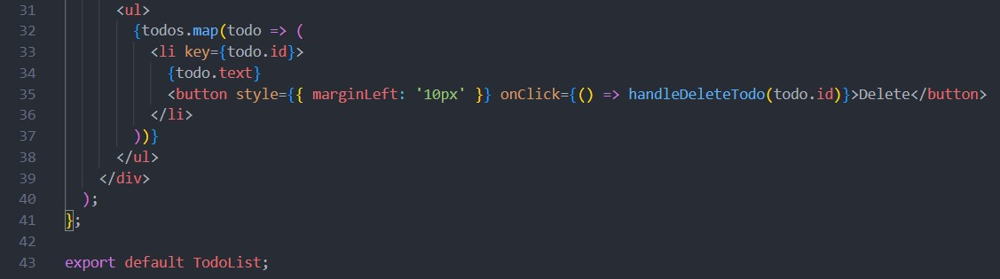
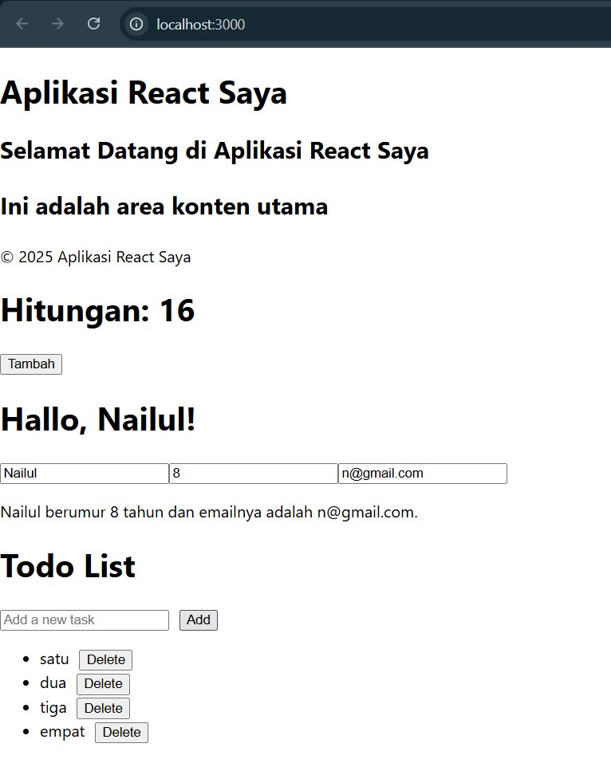

# Praktikum React

## Hasil dari langkah praktikum pertama
Manampilkan judul praktikum dan konten utama

## Hasil dari langkah praktikum kedua Counter
Menambahkan fitur perhitungan pertambahan menggunakan button yang mana ketika button di klik maka angka akan terus bertambah.

## Hasil dari langkah praktikum ketiga Greeting
Menambahkan komponen Greeting ke dalam komponen App dengan mengirim props name.

## Hasil dari langkah praktikum keempat Footer
Menambahkan komponen input nama, umur dan gmail. yang mana ketika inputan diisikan dengan nama, umur dan gmail maka akan tampil sebuah kalimat.

## Hasil dari langkah praktikum kelima Tugas
### 1. Buat komponen baru bernama TodoList yang menampilkan daftar tugas (todo list). Gunakan state untuk mengelola daftar tugas dan props untuk mengirim data tugas ke komponen anak.

### 2. Tambahkan fitur untuk menambahkan tugas baru ke dalam daftar menggunakan form input.

### 3. Implementasikan fitur untuk menghapus tugas dari daftar.

## Hasil

